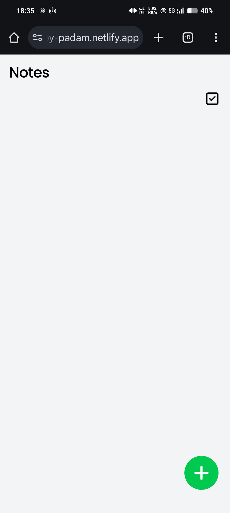
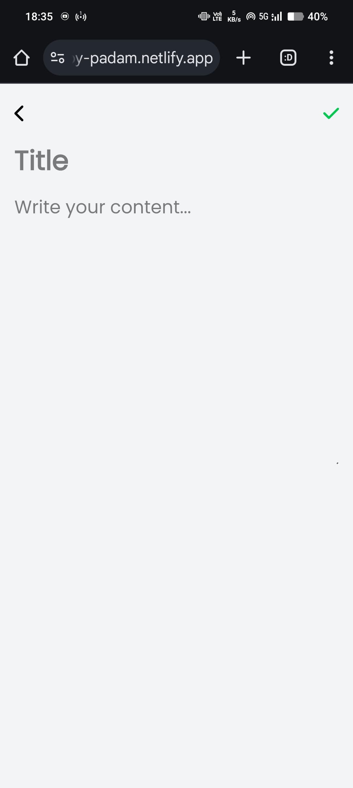
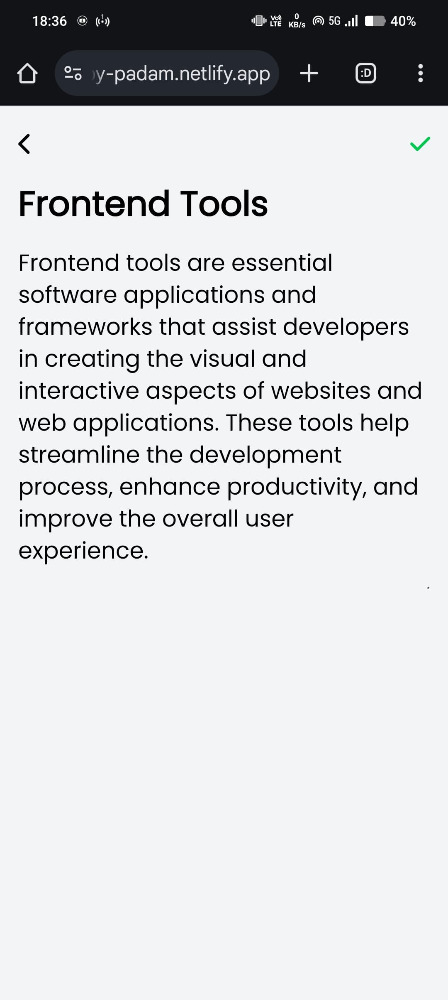
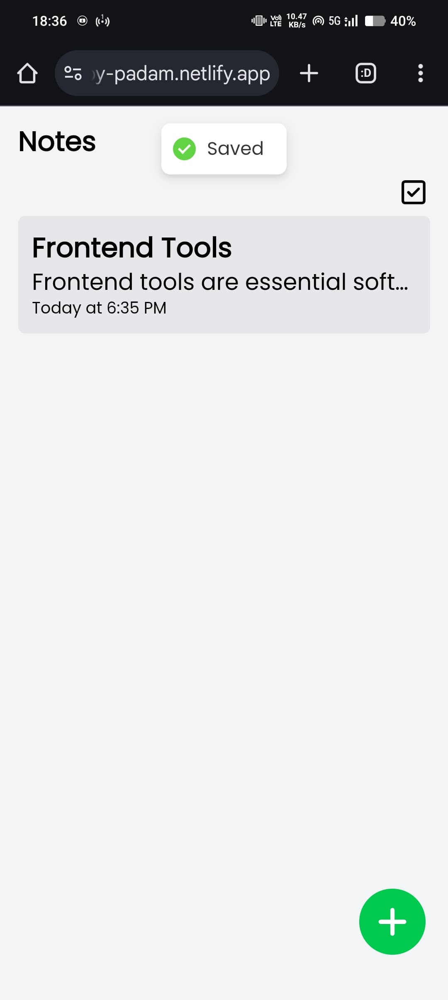
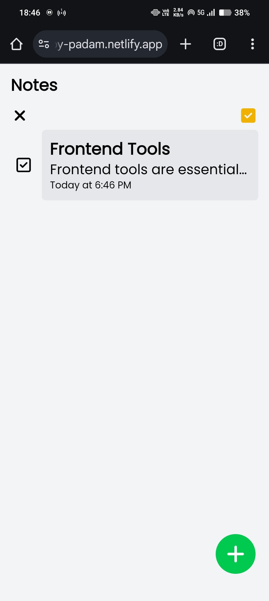
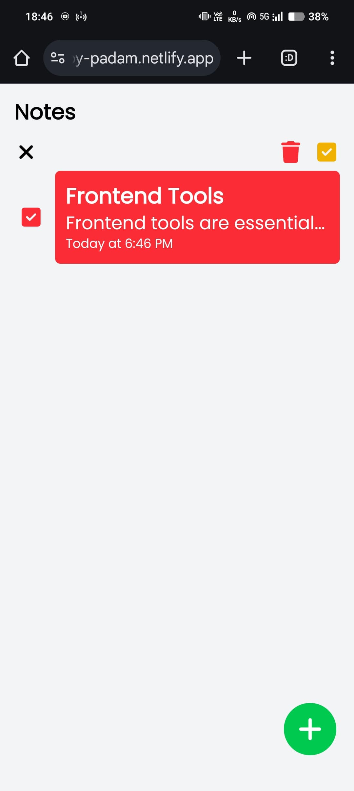
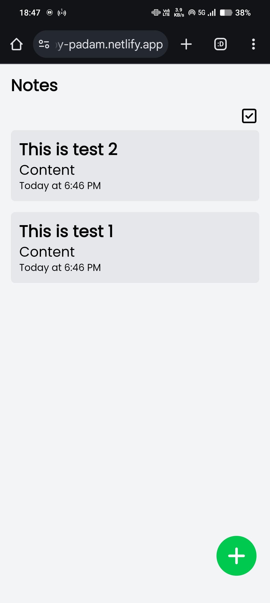

# Notes App

A simple and efficient Notes app built with modern web technologies to help users create, edit, and manage their notes seamlessly.

## 🚀 Features

- 📌 **Add Notes** - Create and store notes with a title and content.
- 🗑️ **Delete Notes** - Remove selected notes individually or in bulk.
- 🕒 **Timestamp Support** - Notes are stored with proper timestamps.
- 🔄 **Auto-Sorting** - Latest notes appear first.
- 🎨 **Beautiful UI** - Built with Tailwind CSS for a sleek and responsive design.

## 🛠️ Tech Stack

- **Frontend:** React (Vite) + Tailwind CSS v4
- **State Management:** Zustand
- **Routing:** React Router
- **Icons:** FontAwesome

## 📦 Installation & Setup

### 1️⃣ Clone the Repository

```sh
git clone https://github.com/padamgadshila/Notes-App.git
cd Notes-App
```

### 2️⃣ Install Dependencies

```sh
npm install
```

### 3️⃣ Run the Development Server

```sh
npm run dev
```

Vite will start the project at `http://localhost:5173/`.

## 📸 Screenshots

| Home Page                                            | Add Note                              |
| ---------------------------------------------------- | ------------------------------------- |
|                 |  |
| Page with notes added                                | Saved note with notification          |
|                 |  |
| Multi-selecting the notes                            | Selecting the note to delete          |
|                 |  |
| Notes are sorted with the latest date and time first |                                       |
|                 |

## ⚙️ Folder Structure

```
📂 Notes-App
├── 📁 src
│   ├── 📂 assets       # Images and icons
│   ├── 📂 components   # Reusable UI components
│   ├── 📂 layouts      # Main app pages
│   ├── 📂 store        # Zustand store for managing state
│   ├── App.css         # Main entry component
│   ├── App.jsx         # Main entry component
│   ├── main.jsx        # Renders the App component
│   ├── index.css       # Renders the App component
│   └── index.css       # Global styles
├── 📄 README.md        # Project documentation
├── 📄 package.json     # Dependencies and scripts

```

## 🔥 Deployment

To deploy your app to **Netlify**, follow these steps:

1. Push your code to **GitHub**.
2. Go to [Netlify](https://app.netlify.com/) and link your repository.
3. Set the build command:
   ```sh
   npm run build
   ```
4. Set the publish directory:
   ```sh
   dist
   ```
5. Click **Deploy** 🎉

## Future Improvements

- 📌 Add real-time collaboration
- 🔊 Voice-to-text notes
- 📅 Note reminders and scheduling

## Contributing

**Contributions are welcome!** Feel free to **fork this repository** and submit a **pull request** if you’d like to improve the app! 🚀

## License

MIT License © 2025 Your Name

Made with ❤️ by **Padam Gadshila** 🎯
